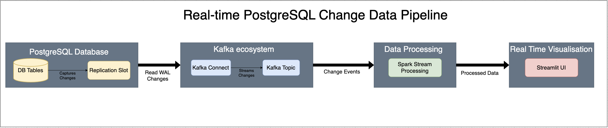
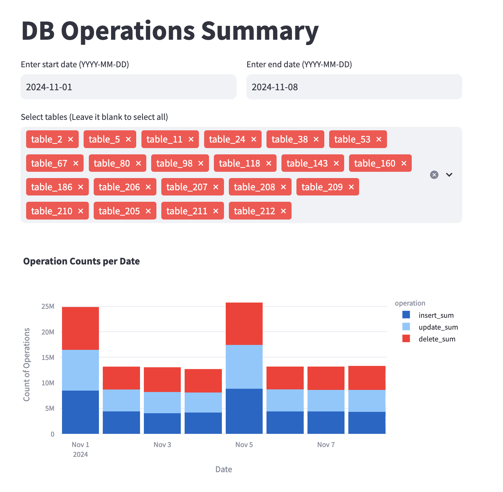
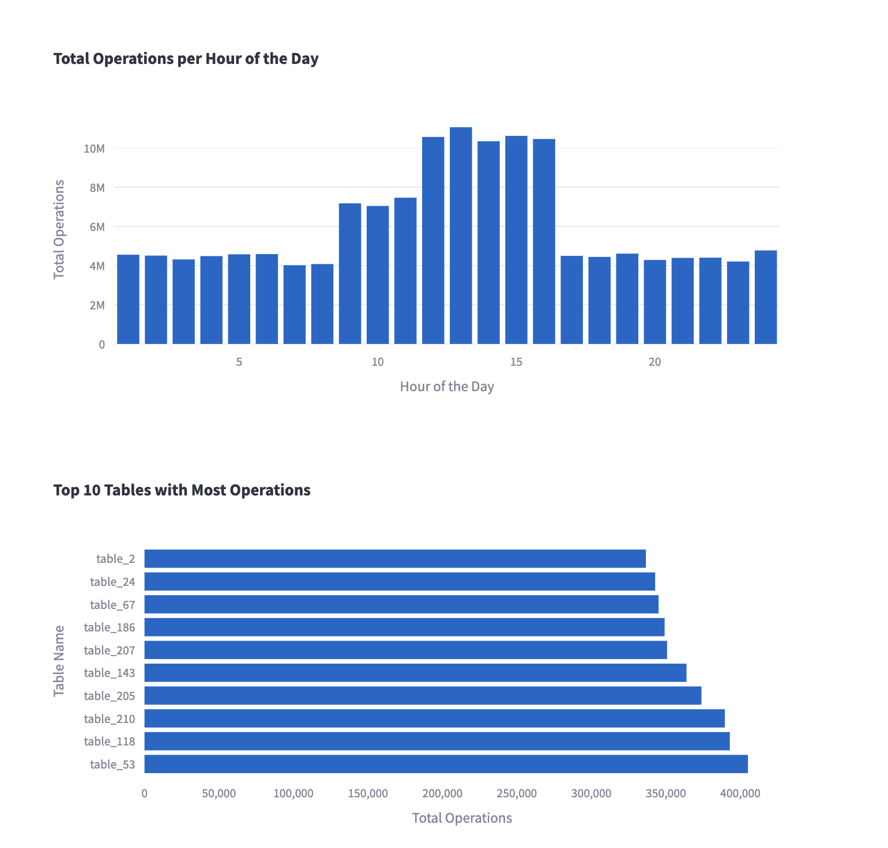

# PostgreSQL Change Data Capture Analytics Dashboard
## Business Problem
Organizations generating extensive PostgreSQL log files face significant storage costs and management challenges. This project provides a real-time analytics solution to:
- Monitor and analyze database operations across tables
- Identify peak periods of database activity
- Optimize storage costs by detecting unnecessary operations
- Enable data-driven decisions for database operation optimization

## Solution Overview


This project implements a real-time change data capture (CDC) pipeline using PostgreSQL replication slots, providing insights into database operations through an interactive dashboard.

### Key Features
- **Real-time Operation Tracking**: Capture and analyze INSERT, UPDATE and DELETE operations
- **Interactive Analytics Dashboard**: Filter and visualize database operations by date, table, and operation type
- **Storage Optimization**: Identify tables and time periods generating excessive logs
- **Cost Reduction**: Enable informed decisions about necessary vs. optimization-worthy operations

### Technology Stack
- **PostgreSQL Replication Slot**: Captures database changes with minimal performance impact
- **Apache Kafka & Kafka Connect**: Ensures reliable, scalable data streaming
- **Apache Spark**: Processes and transforms CDC data in real-time
- **Streamlit**: Provides an interactive visualization interface

## Dashboard Preview

<div style="display: flex;">
  
  
</div>

## Getting Started
### Prerequisites
- PostgreSQL (with replication slot support)
- Apache Kafka
- Apache Spark
- Python 3.7+
- Streamlit

### PostgreSQL Configuration
1. Modify PostgreSQL configuration:
```conf
wal_level = logical
max_replication_slots = 5
max_wal_senders = 10
```

2. Create a replication slot:
```sql
SELECT pg_create_logical_replication_slot('<slot_name>', '<decoding_plugin>');
```

3. Verify slot creation:
```sql
SELECT * FROM pg_replication_slots();
```

### Kafka Setup
1. [Install Kafka](https://hevodata.com/blog/how-to-install-kafka-on-ubuntu/)
2. Configure Kafka Connect:
   - Verify PostgreSQL JDBC driver compatibility
   - Create `/opt/kafka/connect` directory
   - Download confluent-kafka-connect-jdbc connector
   - Update `kafka/config/standalone.properties`

3. Create `kafka/config/jdbc-connector.properties`:
```properties
name=fulfillment-connector
connector.class=io.confluent.connect.jdbc.JdbcSourceConnector
tasks.max=1
connection.url=jdbc:postgresql://<host>:<port>/<db>
connection.user=<postgres user>
connection.password=<postgres password>
mode=bulk
query=SELECT * FROM pg_logical_slot_get_changes('<replication_slot_name>', NULL, NULL)
topic.prefix=<kafka_topic_name>
poll.interval.ms=<time_interval>
```

### Starting the Pipeline
1. Start Zookeeper:
```bash
./bin/zookeeper-server-start.sh config/zookeeper.properties
```

2. Start Kafka:
```bash
./bin/kafka-server-start.sh config/server.properties
```

3. Launch Kafka Connect:
```bash
bin/connect-standalone.sh config/connect-standalone.properties config/jdbc-connector.properties
```

4. Run Spark processing job:
```bash
spark-submit process_cdc.py
```

5. Launch Streamlit dashboard:
```bash
streamlit run dashboard.py
```
